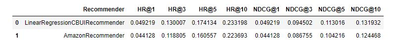

# Recommender systems class project 1: Content based recommender

## Project description

The aim of the project was to prepare real world data, create recommender and then evaluate it with said data.
Recommender is evaluated and tuned with different ML algorithms to check which one will preform
best on data I previously prepared. For the final step we compare recommender that gave the best evaluation scores with 
amazon recommender. 
The goal of this is to potentially beat the amazon recommender working on the same dataset.

### Data preparation

For my users and items features data I prepared 2 different representations. 
- one hot encoded values of features that sum up to 1 for each row
- rows of 1's and 0's where we put 1 only when user interacted at least once with corresponding feature

The first one proved to be vastly superior for Linnear regression recommender that I decided to use in the end. 

Data for both user features and item features was created from previously prepared buckets. I split each bucket 
column into multiple columns one for each unique value in bucket.
This gives us 25 features per user/item id

### Tuning
I prepared the recommender and tuned and tested it with 3 different ML algorithms
imported from sklearn library
- RandomForestRegressor
- LinearRegression
- GradientBoostingRegressor

I tuned them using both versions of my data representation
and this is where I learned that using the first one with float values out preforms use of the other

Here are the scores and best parameters that were chosen by hyperopt tool
#### RandomForestRegressor

#### LinearRegression

#### GradientBoostingRegressor

### Final evaluation

With LinearRegression recommender I was able to beat the scores of Amazon recommender while operating on the same dataset. 
My recommender also worked and calculated much faster than amazon one.

#### Amazon recommender vs. LinearRegression recommender

### Requirements to run the notebooks

1. Install jupyter
    <!-- -->

        pip install jupyter

    
2. Install required python libraries: numpy, pandas, matplotlib, seaboen, IPython.display, sklearn, hyperopt
     <!-- -->

        pip install <name_of_the_package>

   Alternatively if you have Anaconda installed, you can configure enviorment using conda
    <!-- -->
       
    conda env create --name rs-class-env -f environment.yml
    conda activate rs-class-env

3. While in working directory type
         <!-- -->

        jupyter notebook

In git bash or terminal

4. From there you can look trough all files especially
- project_1_data_preparation.ipynb
- project_1_recommender_and_evaluation.ipynb
- data_preprocessing_toolkit.py

These contain majority of code responsible for whole project. You can also run code for yourself from this view.

